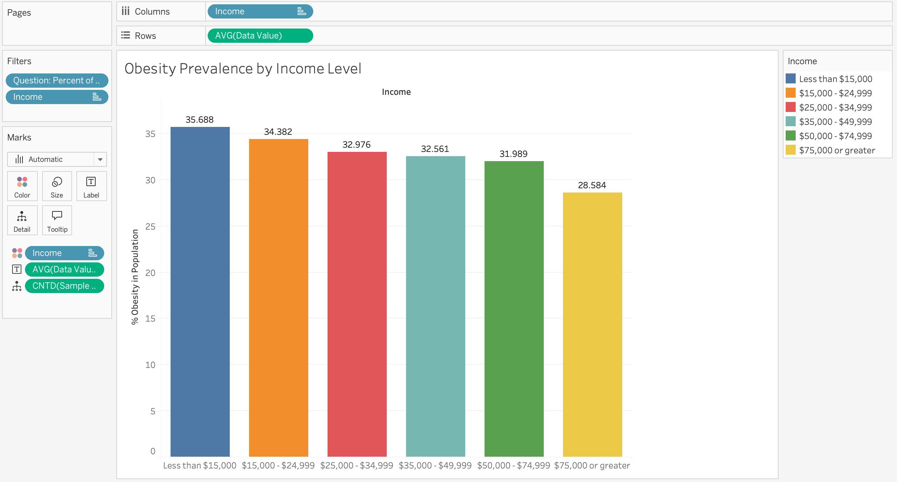
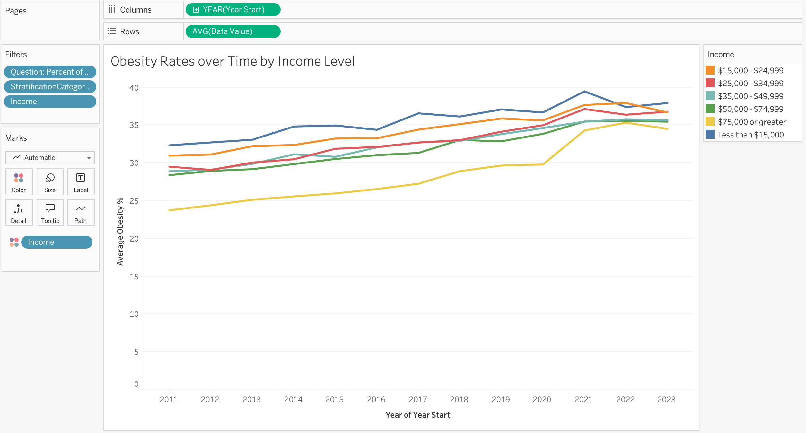
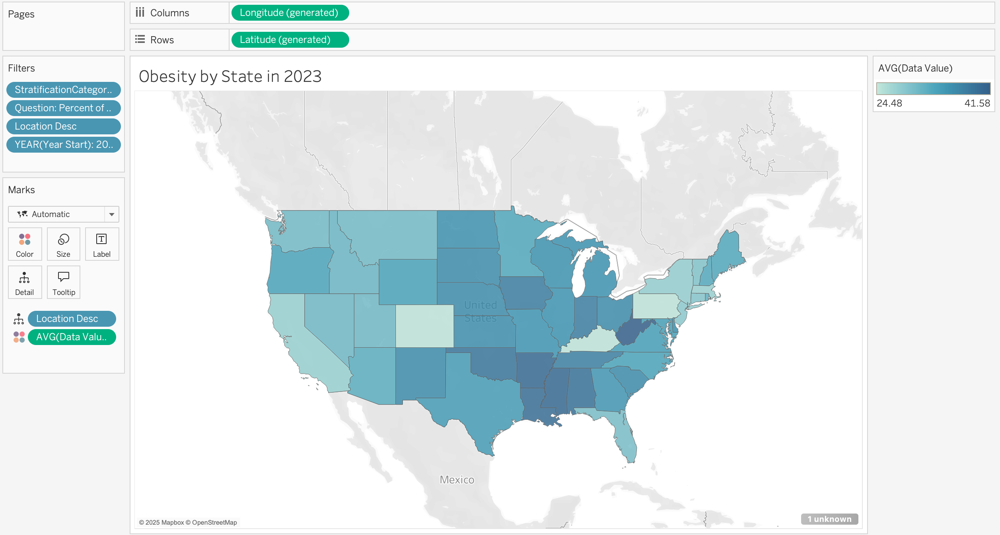
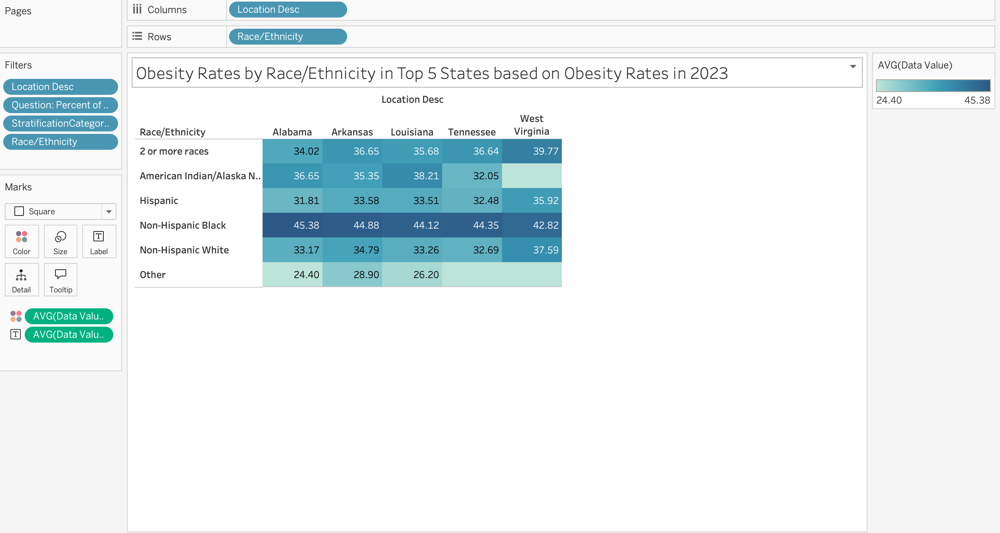

# MIST4610Project2

## Team Name:
59925 Group 1

## Team Members:
1. Jacob Greenwald [@jg79522](https://github.com/jg79522)
2. Iliana Venegas [@imv2ven](https://github.com/imv2ven)
3. Alexa Persad [@aepersad](https://github.com/aepersad)
4. Allison Chaloupek [@allisonchaloupek](https://github.com/allisonchaloupek)
5. David Breen [@davidbreen23](https://github.com/davidbreen23)

## Data Set Overview:
The dataset used comes from the Nutrition, Physical Activity, and Obesity section of the Behavioral Risk Factor Surveillance System (BRFSS) published by the CDC. The information was obtained [here](https://catalog.data.gov/dataset/nutrition-physical-activity-and-obesity-behavioral-risk-factor-surveillance-system). The data contains 106,260 rows and 33 columns, with rows representing population-level estimates for specific demographic subgroups within each state and year. Subgroup categories include Age (years), Sex, Race/Ethnicity, Education, and Income. The field Question describes which health indicator is being measured (“Percent of adults aged 18 years and older who have obesity” for our analysis), and the field Data Value provides the aforementioned population estimate as a percentage.

## Question 1: Explanatory
**Question:**
How does household income level relate to obesity prevalence in 2023? How has this trend changed over time? 

**Importance:**
This question is important because it allows one to see how obesity correlates with different income levels and how that relationship changes over time. One can then identify the proportion of incomes that need the most initiatives and resources and budget those resources accordingly. This helps policy-makers to understand the degree of which incomes are contributing to obesity levels and put policies in place based on the degree of which income is a factor. The second part of the question is important because the trends of obesity levels based on income would help the ability to predict the next levels of obesity and anticipate that change. It can also lead them to conclude what types of events cause certain spikes in obesity levels at certain incomes so they can plan initiatives accordingly if events in a future year mimic those that were in a previous year.

**Graph 1 Description and Results:**
The first graph illustrates the percentage of the population that is obese in each income group. Obesity is the most prevalent in the less than $15,000 a year individuals with an obesity percentage of 35.688% and declines as the individual makes more money. We analyze these rates over time in the next visualization.

**Graph 2 Description and Results:**
To see the trends of the results up until the present year, we graphed these obesity percentages of each income group over time. This would further the findings of the last problem by solidifying the results as a trend over 12 years and show how this relationship evolved over a timeline. While the hierarchy of income to obesity stays relatively constant, certain spikes can be observed, such as the $75,000+ group spiking significantly and aligning more with the other groups in 2020 most likely due to the pandemic. In addition, it is shown that obesity percentages in all groups have consistently trended upwards. This could allow those using the data to predict that obesity will continue to increase and put plans in place with that in mind. The obesity percentages shown in the previous graph are given the context of being the closest the percentages have been in the past 12 years. Therefore, the strategy at which this data is addressed can be more accurate within the context by for example addressing the $75,000+ group with more separation due to their history and perhaps predicting a downward trend in that group.

**Analysis and Helpfulness of Results:**
As time goes on, we can predict that obesity in all income groups except 75,000+ will consistently trend upwards. Although 75,000+ had significantly spiked in 2020, it seems that it will slowly decrease over time after decreasing in 2022. Both graphs show that people who make $15,000 or less a year have the highest obesity rate and the rate will continue to increase. This shows that obesity is not just a health issue, it is also an economical disparity issue. Therefore, resources should go towards individuals with lower income. A resource like free health clinics would allow communities to learn about their health and what they can do to live healthier lives. These resources would help people live healthier lifestyles without worrying about how the bill will be paid.  

## Question 2: Descriptive
**Question:**
What are the states in the U.S. that have the highest level of obesity to date? How do race & ethnicity contribute to obesity in the top 5 states with the highest obesity in 2023? 

**Importance:**
This question is important because it analyzes how location and race/ethnicity are correlated with obesity rates in the continental U.S. This can help the government make decisions on who and where to target health programs towards. With concise data and visualizations, it is easier to ensure health programs are creating tangible results and lowering the obesity rates across America.

**Graph 1 Description and Results:**
This graph illustrates the obesity rates by state in 2023. We excluded Hawaii and Alaska in the data due to not being one of the 48 contiguous states. Alabama, Arkansas, Louisiana, Tennessee and West Virginia are the states with the highest level of obesity.

**Graph 2 Description and Results:**
This graph depicts the obesity rates in 2023 in the states with the top 5 highest obesity rates broken up by race/ethnicity. We have excluded Asians due to lack of data on this race and Hawaiians/Pacific Islanders as we are focusing on the continental United States. Non-Hispanic Black people and people of 2 or more races have the highest obesity rates in these states. The top 5 states with the highest obesity rate are also all in the southeastern part of the United States.

**Analysis and Helpfulness of Results:**
As the top 5 highest obesity rates are all in the southeastern part of the United States, it can be inferred that living in this area is correlated with a higher chance of being obese. Therefore, extra resources should go towards creating and promoting health programs in the southeast. For example, informing people on how to live a healthier lifestyle and the risks of obesity, donating healthy foods to these areas, and encouraging people to be more physically active. Among the states with the highest obesity rates, Non-Hispanic Black people and people of 2 or more races have the highest obesity rates. This could be correlated with these minority groups generally living in low-income areas with less access to healthy foods. These visualizations enable law-makers to focus on people who need the most funding for health programs, which will cause a greater decrease to obesity rates in America than untargeted programs would.

## Manipulations Applied:
No direct data manipulations were performed. The dataset is already standardized and represents population-level estimates by location and time according to the subsets of stratifications and questions. Additionally, it was already properly formatted with data values representing percentages. The only adjustments made were basic filtering to isolate specific measures in order to answer the relevant questions and better display the information.

## Tableau Packaged Workbook:
This is attached in the repository as a packaged workbook and contains all of the visualizations shown above.
